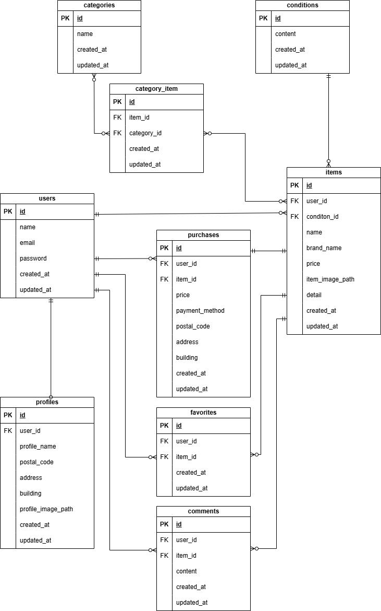

# フリマアプリ（模擬案件）

## 環境構築

### Dockerビルド
1. `git clone git@github.com:iwmz-c/flea-market.git`
2. DockerDesktopアプリを立ち上げる
3. `docker-compose up -d --build`

### Laravel環境構築
1. `docker-compose exec php bash`
2. `composer install`
3. `.env.example` を `.env` にコピー
``` bash
cp .env.example .env
```

4. アプリケーションキーの作成
```bash
php artisan key:generate
```

5. マイグレーションの実行
```bash
php artisan migrate
```

6. シーディングの実行
```bash
php artisan db:seed
```

## 使用技術（実行環境）
- PHP 8.1
- Laravel 8.83.8
- MySQL 8.0.26
- JavaScript
- Docker / Docker Compose

## ER図


## 開発環境
- トップページ：http://localhost/
- ユーザー登録：http://localhost/register
- phpMyAdmin：http://localhost:8080/